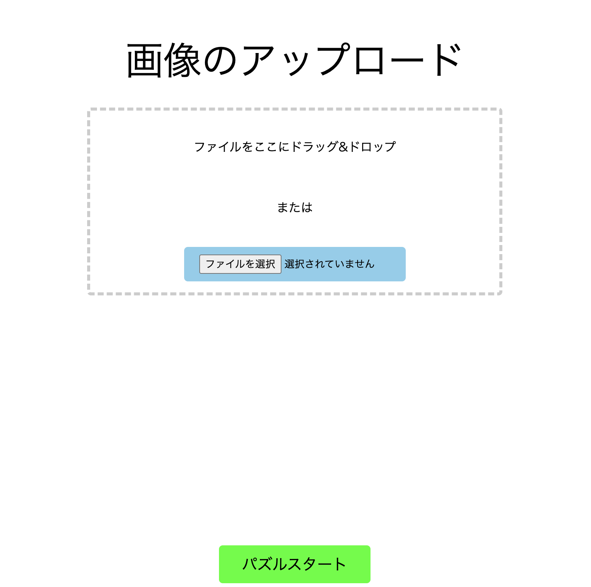
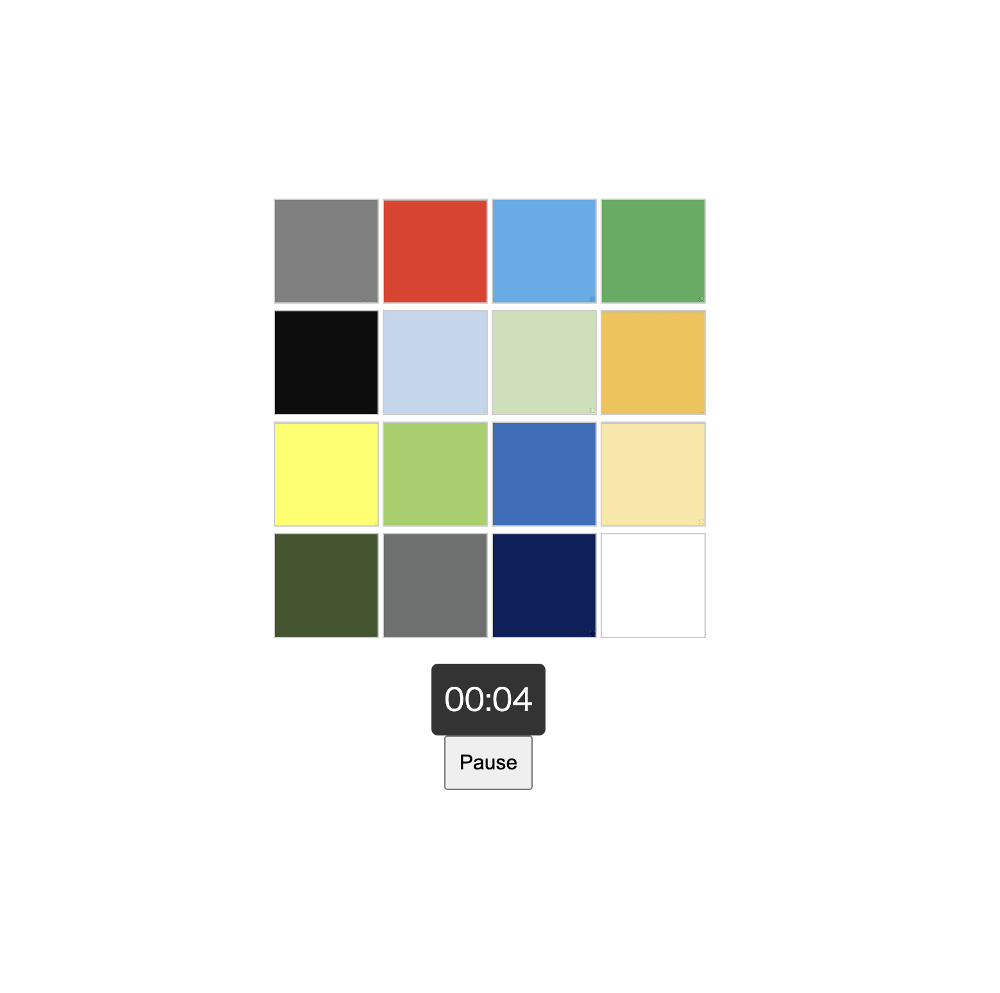
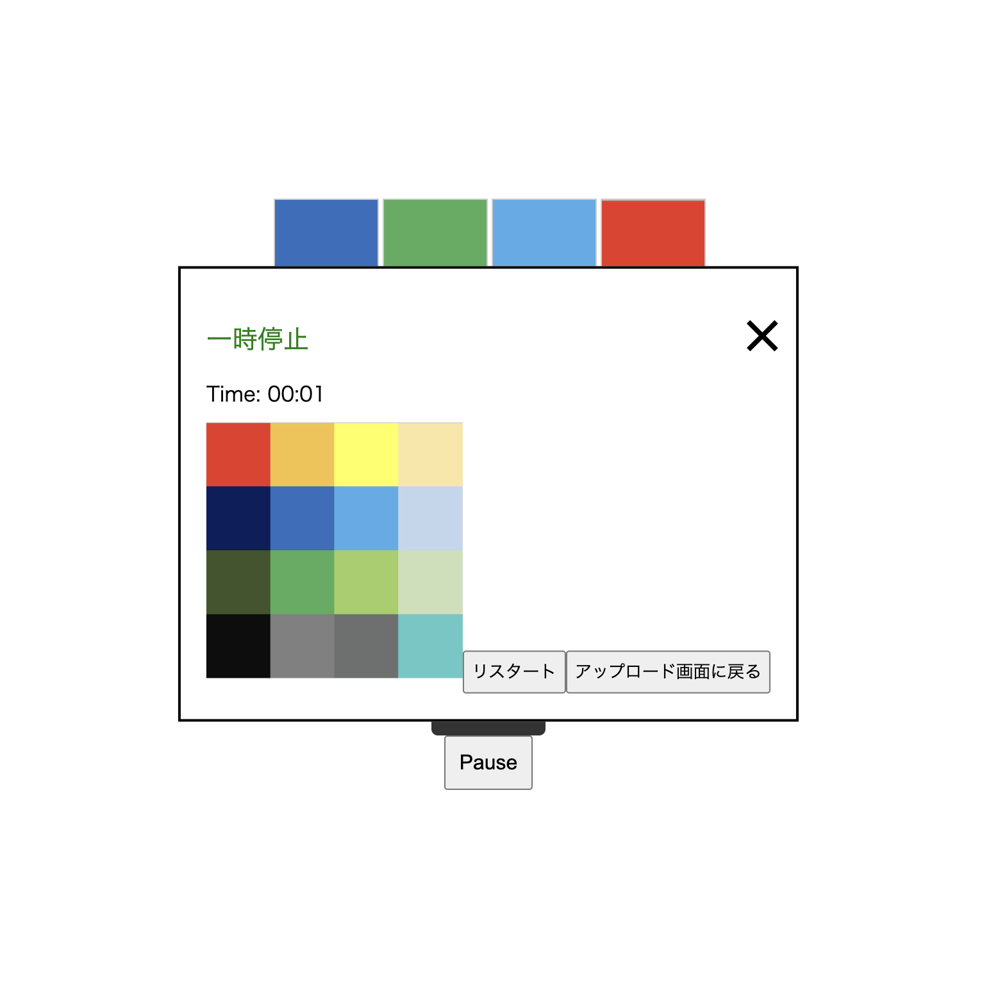

## プロジェクト名 

xvpuzzle


## 概要

自分の好きな画像を入力することで遊べる4x4のパズルゲーム


## 自分の環境で実行する場合
### 初期設定
\$ git clone https://github.com/2023AIT-OOP2-G01/xvpuzzle.git<br>
\$ cd xvpuzzle<br>
\$ python -m venv .env<br>
\$ source .env/bin/activate<br>
(.env) $ pip install -r requirements.txt<br>

### 必要なバージョン
Python version : 3.11.5 or higher<br>
Gunicorn (web　デプロイ時)<br>
Flask==3.0.0<br>
Pillow==10.1.0<br>

### 起動方法
image_upload.pyを実行後、 Running on URL が表示される<br>
ブラウザを開き URLにアクセス

\$ source .env/bin/activate<br>
(.env) $ python image_upload.py<br>


## 実行方法

以下のページで画像ファイルを読み込んだ後にパズルスタートボタンを押すとゲームが始まります



空白に隣接ピースをクリックすることで一マスづつ動かすことができます<br>



Pauseボタンを押すことで完成図が表示されます<br>



パズルを完成させるとゲームが終了し、かかった時間が表示されます<br>

## ディレクトリ構造

```
├── static 
│     └── styles.css
│     └── home.css
│     └── home.js
│     └── puzzle.css
│     └── puzzle.js
│     └── timer.js
│     └── divided_images
│             └── 16分割された画像と分割前の画像
│   
├── templates
│     └── home.html
│     └── puzzle.html
│     └── upload_images
│             └── 分割前の画像
│   
├── image_divide.py
├── image_upload.py
└── README.md
```


## ファイルの機能

### static 
- home.css : home.htmlの修飾を行う
- home.js : home.htmlの処理を行う
- puzzle.css : puzzle.htmlの修飾を行う
- puzzle.js : puzzle.htmlの処理を行う
- timer.js : カウントタイマーの処理を行う

### templates 
- home.html : ホームページの骨組みを行う
- puzzle.html : 実際にパズルをプレイするページの骨組みを行う

### pythonファイル
- image_divide.py : 画像を16分割し、divided_imagesに16分割した画像を保存する
- image_upload.py : 画像ファイルが選択されているか確認する

